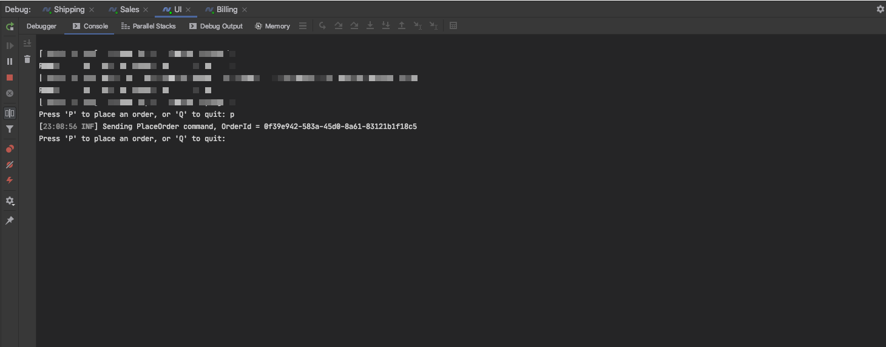
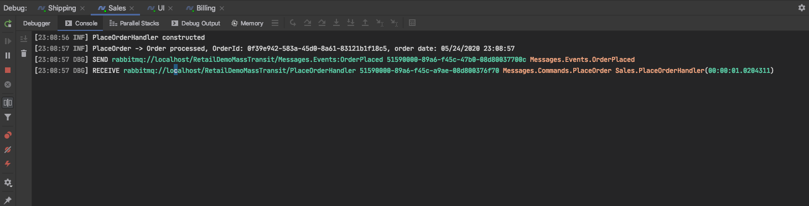
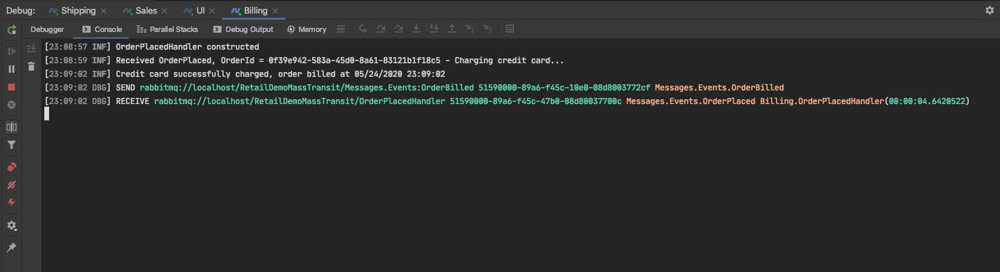
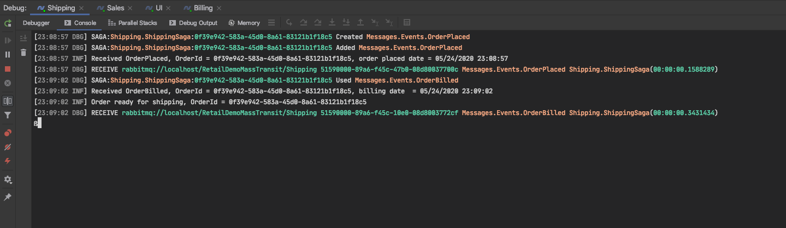

# RetailDemoMassTransit
An implementation of NParticular Step-by-Step tutorial using MassTransit.
The tutorial for NServiceBus is here: https://docs.particular.net/tutorials/nservicebus-step-by-step/ 

## RabbitMq 
Easiest way to get RabbitMq up and running is to use Docker:

- https://www.docker.com/get-started

Then get the RabbitMq image:

```
docker pull rabbitmq
```
More info here: https://www.rabbitmq.com/download.html

Then run the container with these parameters, this will expose the RabbitMq ports.

```
docker run -it --rm --name rabbitmq -p 5672:5672 -p 15672:15672 rabbitmq:3-management
```

You should now be able to open the RabbitMq management portal at http://localhost:15672

## System running







